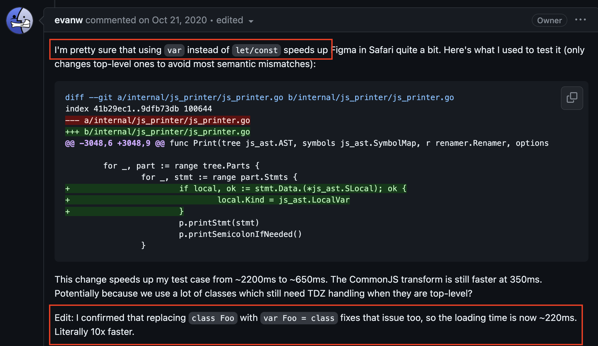
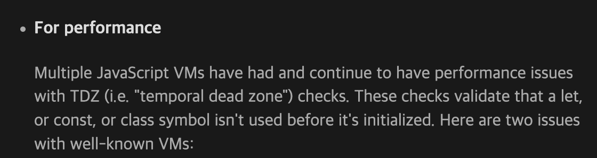

## const에서 var로 돌아가기

TypeScript 프로젝트를 구경하다가 흥미있는 이슈를 보았다. 성능을 위해 일부 코드를 **const에서 var로 변경한다**는 내용이었다. ([#52924](https://github.com/microsoft/TypeScript/issues/52924))


PR을 이해하기 위한 맥락과 PR의 내용을 정리하면 다음과 같다.

- TypeScript는 Self-hosting 언어로, TypeScript 컴파일러는 TypeScript로 작성되어 있다.
- TypeScript 5.0부터 ESM 지원을 위해 TypeScript 컴파일러의 target을 **ES5에서 ES2018**로 전환했다.
- 그런데 `let`과 `const`를 사용했더니 성능이 느려졌다.
- 성능을 위해 var로 다시 돌아간다.

var 키워드의 성능이 더 빠르다는 것은 처음 들어보는 이야기였다. 궁금증을 위해 조사를 한 내용을 정리해보려고 한다.

### var 키워드

자바스크립트는 이상하고 재미있는 특징이 많다. 그 중 `var` 키워드는 스코프, 중복 선언 가능, 호이스팅 등 여러 문제점을 가지고 있다. 문제점 중 하나는 "var로 선언한 변수는 선언 전에 사용할 수 있다" 는 것이다. 선언 전에 접근하면 "undefined"를 반환한다.

```js
{
  console.log(a); // undefined
  var a = 1;
}
```

다른 프로그래밍 언어라면 에러를 발생시킬 것 같지만 자바스크립트는 에러없이 undefined를 출력한다. 변수 a를 선언하기 전에 a를 참조하고 있음에도 이 코드는 에러없이 정상적으로 동작한다. `var 호이스팅` 때문인데, 자바스크립트를 만든 Brendan Eich에 따르면 이러한 var 호이스팅은 바쁜 작업으로 인한 의도하지 않은 결과라고 한다.


var 키워드의 문제를 해결하기 위해 ES6에서 let, const 키워드가 등장했다.

## TDZ(Temporal Dead Zone)

let, const 키워드는 `TDZ`를 도입한다. TDZ 덕분에 변수 선언 이전의 사용을 엄격하게 금지한다. let, const로 선언한 변수를 선언 전에 사용하려고하면 `ReferenceError`를 발생시킨다. 변수가 선언되기 전까지는 TDZ 내부에 있다고 볼 수 있다.

```js
{
  console.log(a); ---  // TDZ 내부에 있는 a를 참조하려고 하면 ReferenceError 발생한다
  ...                | // TDZ
  ...                | // TDZ
  ...             ---
  let a = 1; // 변수 선언
}
```

## TDZ 검사

문제는 TDZ 검사 비용이다.

`ReferenceError`를 발생시키기 위해서는 **런타임에 자바스크립트 엔진이 어떤 변수에 대해 TDZ에 존재하는지 아닌지를 검사해야한다**. 즉, TDZ 검사를 위해 자바스크립트 엔진은 런타임 비용을 발생시키는 것이다.

V8과 같은 자바스크립트 엔진은 다양한 최적화를 수행하기 때문에 소규모 코드베이스의 비용은 무시할만한 수준이다. 하지만 경우에 따라 TDZ 검사 비용이 무시할 수 없을 정도로 커질 수 있다. 또, 모든 TDZ 검사가 무거운 비용은 아니다. 아래 코드 처럼 쉽게 분석할 수 있는 경우 TDZ 검사 비용은 가볍다.

```js
{
  let x;
  x;
}
```

하지만 다음같이 복잡한 경우 자바스크립트 엔진이 런타임에 수행하는 TDZ 검사 비용은 커질 수 있다.

```js
{
  foo(); // ReferenceError: x is not defined

  let x;
  function foo() {
    x;
  }
}
```

foo 함수가 에러없이 호출되기 위해서는 foo 함수가 참조하고 있는 **최상위 공유 클로저 변수 x**가 평가되었는지 먼저 확인해야한다.
let으로 선언되었기 때문에 x가 TDZ에 있는지 확인해야하는데 x는 foo 함수 내부에서 선언된 변수가 아니기 때문에 전체 스코프를 검사해야한다.
대규모 코드베이스에서 TDZ 검사 비용은 의미있을 정도로 커질 수 있다.

### 10배 느린 let, const

TDZ 검사 비용는 자바스크립트 엔진이 수행하기 때문에 엔진의 구현에 따라 TDZ 검사 비용이 다를 수 있다.
실제로 Webkit의 자바스크립트 엔진인 JavaScriptCore는 let, const가 var 보다 무려 **10배 느린 문제점**이 존재했었다. (\*현재는 고쳐진 것으로 보인다.)

- [Safari에서 10배 느린 let, const 성능 문제 이슈](https://github.com/evanw/esbuild/issues/478)
- [Webkit 버그 리포트](https://bugs.webkit.org/show_bug.cgi?id=199866)



V8 엔진에도 var과 let,const 사이에 10% 정도의 성능 차이가 존재한다는 버그 리포트가 있다.

- [V8 버그 리포트](https://bugs.chromium.org/p/v8/issues/detail?id=13723)

### TC39에서도 논의되었다

이러한 TDZ 검사 비용 문제는 ECMAScript 표준을 개발하고 유지 관리하는 그룹인 TC39에서도 [논의](https://github.com/tc39/notes/blob/main/meetings/2023-09/september-27.md#tdz-what-is-it-good-for)되었다. `TDZ는 뭐에 좋은가요?`라는 주제로 let, const에서 TDZ 검사를 제거하자는 아이디어가 논의되었다. 비교적 최근인 2023-09월에 논의되었기 때문에 당장 바뀌지는 않을 것으로 보인다.


## var 사용해서 성능 향상하기

TypeScript가 var로 성능을 향상시킨 예시를 보자. 다음은 TypeScript 컴파일러의 소스코드 중 일부이다.

```js
// src/compiler/parser.ts

// const -> var로 전환
// const scanner = createScanner(ScriptTarget.Latest, /*skipTrivia*/ true);
var scanner = createScanner(ScriptTarget.Latest, /*skipTrivia*/ true);

function initializeState() {
  // .....
  // .....
  // .....
  // .....
  scanner.setText(sourceText);
  scanner.setOnError(scanError);
  scanner.setScriptTarget(languageVersion);
  scanner.setLanguageVariant(languageVariant);
}
```

const로 선언된 scanner 변수를 var로 변경한했다. 변수 scanner는 생성 비용이 크기 때문에 매번 새롭게 생성하는 것은 비효율적이다. 그래서 최상위 레벨 스코프에서 한 번만 생성하고 다른 함수들이 공유해서 사용한다.

자바스크립트 엔진은 런타임에 const로 선언된 scanner 변수에 대해 TDZ 검사를 수행해야한다. parser.ts 파일 하나의 전체 라인은 **10,000줄**이 넘는다. 대규모 코드베이스에 존재하는 변수 scanner를 참조하는 함수가 많다면 해당 함수를 호출하거나 참조할때마다 생기는 TDZ 검사 비용은 커질 수 있다.

TypeScript 팀은 const로 선언된 scanner를 var로 변경하여 TDZ 검사 비용을 줄였는데 **실제로 var 키워드로 전환하는 것만으로 최대 10~13% 정도의 성능 향상을 가져왔다고 한다.**

- [#52832](https://github.com/microsoft/TypeScript/pull/52832)

### esbuild

많이 사용하는 번들러인 esbuild도 var 키워드를 사용하여 성능을 향상시킨다. 런타임에 TDZ 검사 비용을 줄이기 위해 esbuild는 번들 과정에서 최상위 레벨에 선언된 let, const로 작성된 코드를 var로 변환한다. 그레서 vite로 생성한 React 프로젝트의 번들 파일을 보면 var 키워드가 많이 사용되어 있다.



## 마무리

그렇다면 프론트엔드 개발자는 성능을 위해 var 사용을 고려해야할까? 대규모 코드베이스에서 var은 let, const 보다 빠르다는 것은 어느정도 사실인 것 같다. 하지만 대부분의 프론트엔드 개발자가 이러한 저수준의 성능 최적화는 신경쓰지도 않고, 신경쓸 필요도 없다는 것이 내 생각이다.

만약 극단적인 성능 최적화를 달성해야한다면 var를 사용하여 TDZ 검사를 회피하고 자바스크립트 엔진의 런타임 비용을 줄이는 것도 하나의 방법이 될 수 있다. **성능과 var이 가진 문제점 사이의 트레이드오프를 고려하여 사용하면 될 것이다.**
